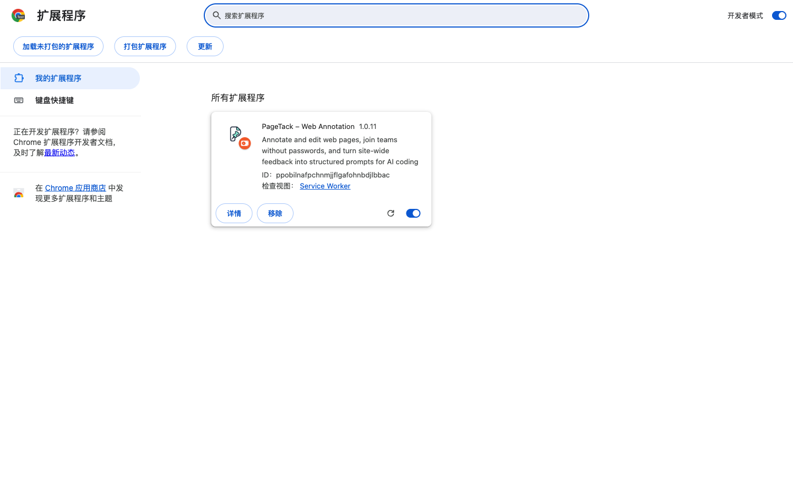
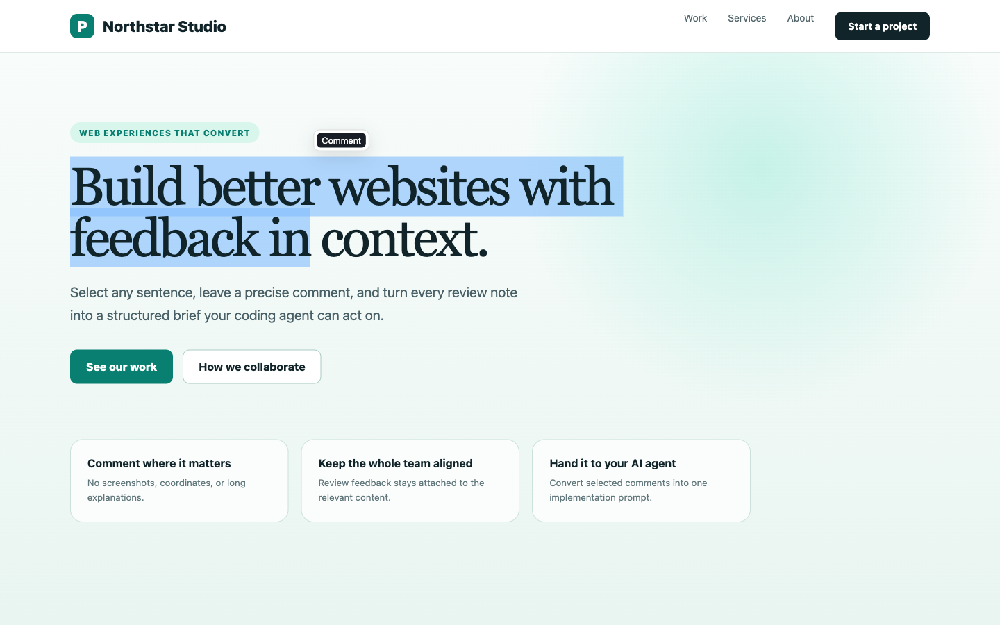
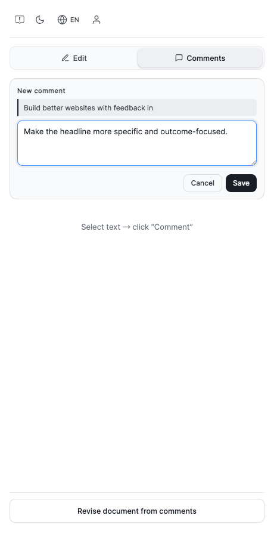
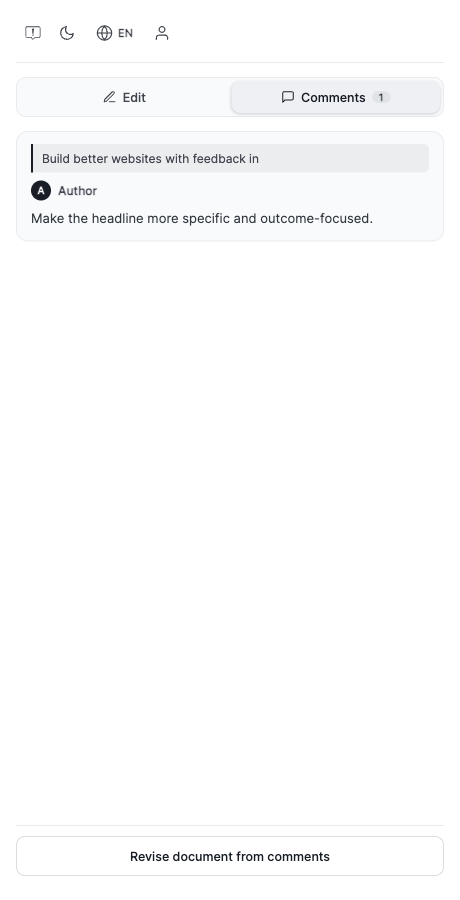
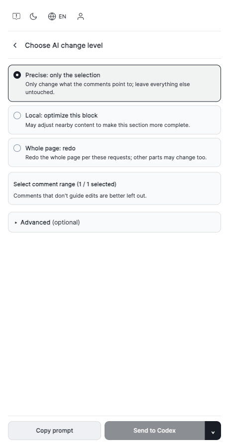

# PageTack 1.0.11 本地测试包图文教程

> 从安装、网页评论到批量整理给 AI，全程约 3 分钟。想看排版更好的版本，请直接打开同目录的 [`index.html`](index.html)。

## 0. 准备测试包

测试包文件名应为 `PageTack-1.0.11-local-test.zip`。

- macOS：双击 ZIP 解压。
- Windows：右键 ZIP，选择“全部解压”。
- 打开解压后的文件夹，确认里面直接包含 `manifest.json`。

> 不要直接选择 ZIP，也不要加载没有 `-local-test` 后缀的 Chrome Web Store 上传包。商店包不带固定开发 ID，反复加载可能产生多个扩展副本。

## 1. 在 Chrome 加载扩展

1. 在地址栏输入 `chrome://extensions/` 并回车。
2. 打开右上角“开发者模式”。
3. 点击左上角“加载已解压的扩展程序”。
4. 选择刚才解压、且里面直接包含 `manifest.json` 的文件夹。
5. 看到 “PageTack – Web Annotation 1.0.11” 且开关为蓝色，即安装成功。

建议点击 Chrome 右上角拼图图标，把 PageTack 固定到工具栏。打开需要检查的网站后，点击 PageTack 图标即可打开右侧栏。

## 2. 选择网页文字并添加评论

1. 打开任意普通网页，并保持 PageTack 侧栏开启。
2. 按住鼠标，从文字开头拖到结尾；正向或反向选择都可以。
3. 松开鼠标后，点击选区附近出现的黑色 **Comment** 按钮。

在侧栏的 New comment 卡片中输入修改意见，然后点击 **Save**。

推荐写成“把标题改得更具体，并强调转化结果”，不要只写“这里不好”。意见越明确，设计师或 AI 越容易准确执行。

## 3. 查看评论

评论会显示在 **Comments** 标签中。每张卡片都包含选中的原文、作者和修改意见。继续在网页上选择其他文字即可逐条添加，无需每写一条就刷新网页。

未登录时，评论只保存在当前浏览器。登录并加入团队后，团队评论会同步到服务器，其他成员在同一个网站也能看到。

## 4. 批量交给 AI 修改

点击侧栏底部的 **Revise document from comments**。

三种修改范围：

- **Precise: only the selection**：只改评论指向的内容，其他部分不动，日常修订首选。
- **Local: optimize this block**：可调整附近内容，使当前区块更完整。
- **Whole page: redo**：按全部意见重做整页，其他部分也可能变化。

选择要执行的评论后，点击 **Copy prompt** 粘贴到任意 AI；已配置本机 Agent 时也可以直接 **Send to Codex**。

登录团队后，PageTack 可以按当前网站域名从服务器读取未解决评论，再统一复制给 AI。未登录的本地评论只存在当前浏览器，后端无法直接读取。

## 5. 更新新版测试包

1. 解压新版 `PageTack-x.x.x-local-test.zip`。
2. 打开 `chrome://extensions/`，找到 PageTack。
3. 如果仍使用原文件夹，替换文件后点击卡片右下角的圆形箭头；如果改用新文件夹，移除旧测试扩展，再加载新文件夹。
4. 关闭并重新打开 PageTack 侧栏。1.0.11 会自动接管已打开网页里的旧脚本，多数情况下不需要刷新网页。

如果扩展卡片显示的版本不是最新版，通常是选错了解压目录，或 Chrome 仍加载着旧副本。移除重复的 PageTack 测试扩展，只加载一个正确文件夹。

## 常见问题

| 问题 | 处理方法 |
| --- | --- |
| 没有出现 Comment | 确认选区仍是蓝色；不能在 `chrome://`、Chrome 商店等浏览器受限页面使用。重新打开侧栏后再选一次。 |
| 提示 Select text first | 先在网页正文中拖选文字，松开后直接点选区旁的 Comment，不要先点侧栏导致选区消失。 |
| 本地 HTML 不工作 | 进入扩展“详情”，开启“允许访问文件网址”；也可以用 `http://127.0.0.1` 本地服务器打开。 |
| 无痕模式不工作 | 进入扩展“详情”，开启“在无痕模式下启用”。Chrome 默认关闭此权限。 |
| 新版行为没生效 | 在扩展卡片点圆形箭头并重新打开侧栏；仍不生效时再对目标网页强制刷新一次。正常使用不需要反复刷新。 |
| 换电脑后评论不见了 | 未登录评论属于浏览器本地数据；需要跨设备或共享时，请登录并加入同一团队。 |
